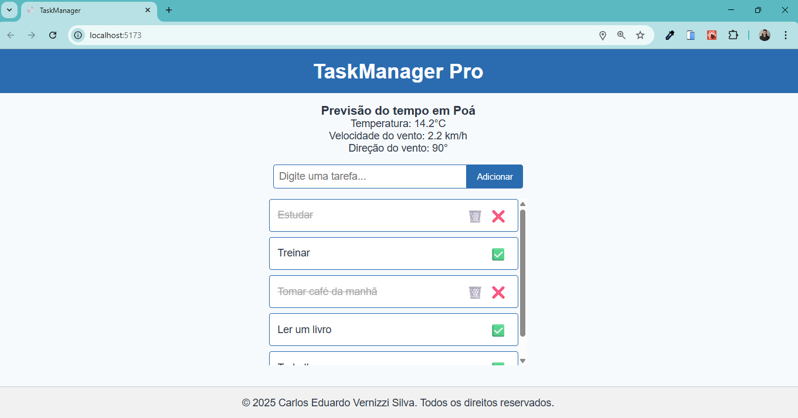

# Task Manager Pro

## Descrição

Task Manager Pro é uma aplicação React desenvolvida para gerenciar tarefas com funcionalidades completas: adicionar, marcar como concluída, deletar e persistir os dados localmente. Além disso, o projeto integra uma API de previsão do tempo que utiliza a localização geográfica do usuário para exibir informações climáticas atuais.

---

## Funcionalidades

- **Gerenciamento de tarefas:** adicionar, marcar como concluída e excluir.
- **Persistência local:** armazenamento das tarefas no `localStorage`.
- **Consumo de API externa:** integração com a API Open-Meteo para previsão do tempo.
- **Geolocalização dinâmica:** captura da localização do usuário para exibir a previsão local.
- **Interface responsiva** e organizada com SASS utilizando partials para escalabilidade.

---

## Principais conceitos e tecnologias aplicadas

### React Hooks

- **useState:** para gerenciar o estado das tarefas, controle de formulários, dados da previsão do tempo e status de carregamento.
- **useEffect:** utilizado para:
  - Buscar a localização do usuário via geolocalização.
  - Consumir APIs externas para buscar o nome da localização (Reverse Geocoding) e dados da previsão do tempo.
  - Sincronizar o estado das tarefas com o `localStorage`, garantindo persistência dos dados entre sessões.
- **Props:** comunicação entre componentes (ex: passagem das tarefas para lista e manipulação de estados entre componentes).

### Consumo de API

- Integração com a API [Open-Meteo](https://open-meteo.com/) para previsão do tempo atual.
- Uso da API [Nominatim (OpenStreetMap)](https://nominatim.org/release-docs/develop/api/Reverse/) para conversão de coordenadas geográficas em nomes legíveis de localidades.
- Tratamento assíncrono com fetch, utilizando promises para requisições e tratamento de erros.

---
